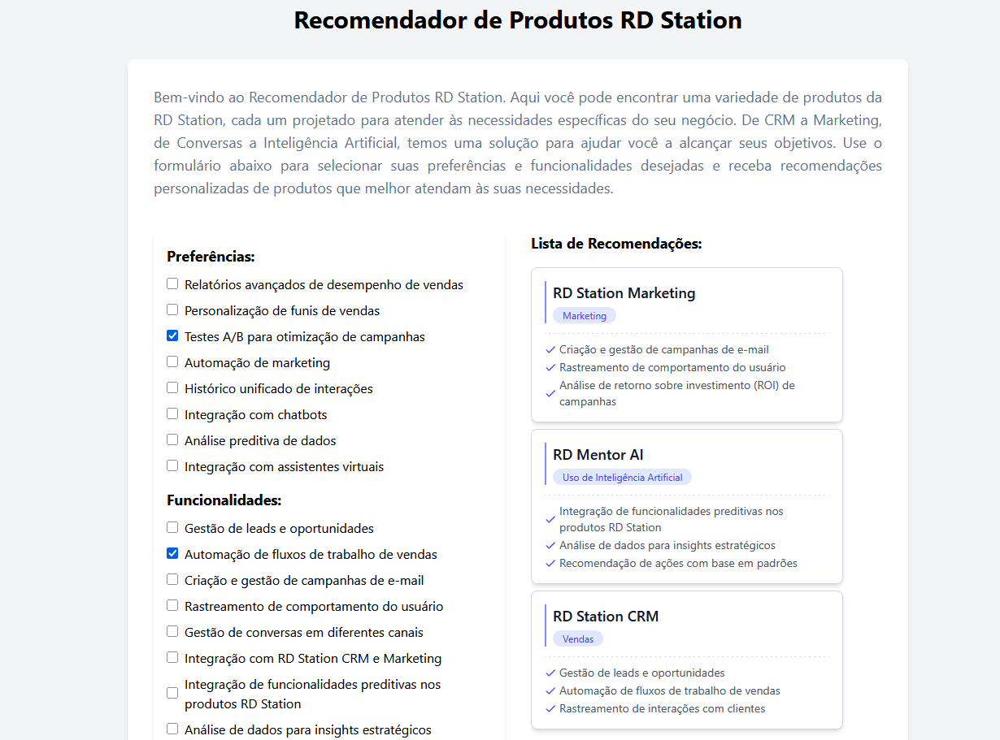

## Product Recommender

[🇬🇧 English](#products-recommender) | [🇧🇷 Português](#Recomendação-de-Produtos)

---

## Products Recommender

A product recommendation system built with React, TailwindCSS, and a simulated API using json-server.

📌 Features

- [x] User preference form (multiple choice)
- [x] Single and multiple product recommendation logic
- [x] Visual list of recommended products
- [x] Dynamic badges and icons
- [x] Modular architecture
- [x] Unit tests for business logic

🚀 Technologies Used

[](https://skillicons.dev)

📸 Demo

📍 Home Screen



### Mobile


🔧 How to Run the Project

Be sure to use a Node version 18.3 or higher

Clone the repository:

```
git clone https://github.com/Cleber-Severo/products-recommendation.git
```

Navigate to the project folder:

```
cd ./products-recommendation
```

Install dependencies:

```
yarn install
```

Execute Installation Script

```
./install.sh
```

Start the application

```
yarn start
```

## Recomendação de Produtos

Um sistema de recomendação de produtos desenvolvido com React, TailwindCSS e uma API simulada utilizando o json-server.

📌 Funcionalidades

- [x] Formulário de preferências do usuário (escolha múltipla)
- [x] Lógica de recomendação de produto único e múltiplos produtos
- [x] Lista visual de produtos recomendados
- [x] Selos dinâmicos e ícones
- [x] Arquitetura modular
- [x] Testes unitários para a lógica de negócio

🚀 Técnologias Utilizadas

[](https://skillicons.dev)

📸 Demo

📍 Página Inicial


### Mobile


🔧 Como rodar o projeto

Se certifique de estar na versão 18.3 do Node ou superior

Clone o repositório:

```
git clone https://github.com/Cleber-Severo/products-recommendation.git
```

Navegue até a pasta do projeto:

```
cd ./products-recommendation
```

Instale as dependências:

```
yarn install
```

Execute o script de instalação:

```
./install.sh
```

Inicie a Aplicação

```
yarn start
```
