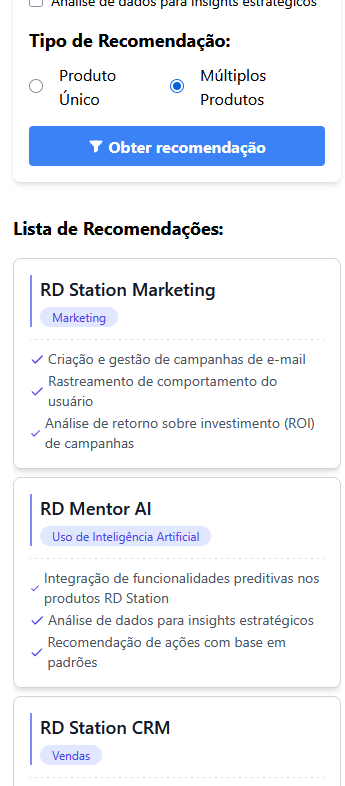

## Product Recommender

[🇬🇧 English](#products-recommender) | [🇧🇷 Português](#Recomendação-de-Produtos)

---

## Products Recommender

A product recommendation system built with React, TailwindCSS, and a simulated API using json-server.

📌 Features

- [x] User preference form (multiple choice)
- [x] Single and multiple product recommendation logic
- [x] Visual list of recommended products
- [x] Dynamic badges and icons
- [x] Modular architecture
- [x] Unit tests for business logic

🚀 Technologies Used

[](https://skillicons.dev)

📸 Demo

### 📍 Home Screen


### Mobile



### 🔧 How to Run the Project

Be sure to use a Node version 18.3 or higher

1. Clone the repository
```
git clone https://github.com/Cleber-Severo/products-recommendation.git
cd ./products-recommendation
```

2. Install dependencies

```
yarn install
```

3. Execute Installation Script
```
./install.sh
```

4. Start the application
```
yarn start
```

### 📜 License

This project is licensed under the MIT License. Feel free to use and modify it!

Developed with ❤️ by Cléber Severo 🚀

---

## Recomendação de Produtos

Um sistema de recomendação de produtos desenvolvido com React, TailwindCSS e uma API simulada utilizando o json-server.

📌 Funcionalidades

- [x] Formulário de preferências do usuário (escolha múltipla)
- [x] Lógica de recomendação de produto único e múltiplos produtos
- [x] Lista visual de produtos recomendados
- [x] Selos dinâmicos e ícones
- [x] Arquitetura modular
- [x] Testes unitários para a lógica de negócio

🚀 Técnologias Utilizadas

[](https://skillicons.dev)

📸 Demo

### 📍 Página Inicial


### Mobile


🔧 Como rodar o projeto

Se certifique de estar na versão 18.3 do Node ou superior

1. Clone o repositório
```
git clone https://github.com/Cleber-Severo/products-recommendation.git
cd ./products-recommendation
```

2. Instale as dependências
```
yarn install
```

3. Execute o script de instalação
```
./install.sh
```

4. Inicie a Aplicação
```
yarn start
```

📜 Licença

Este projeto está licenciado sob a MIT License. Sinta-se livre para utilizá-lo e modificá-lo!

Desenvolvido com ❤️ por Cléber Severo 🚀
